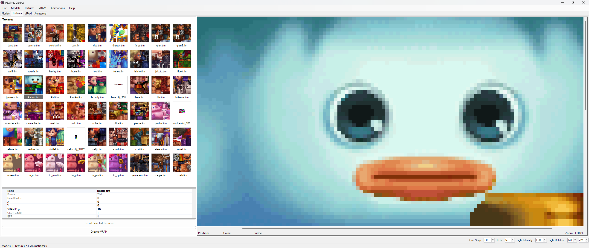
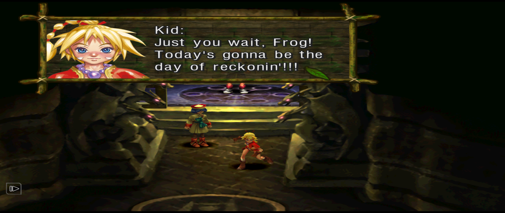
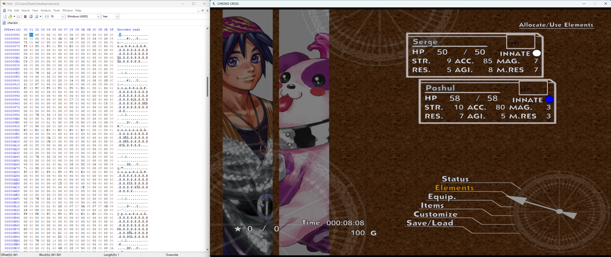

# Modding Chrono Cross
A short guide on modding Chrono Cross: The Radical Dreamers Edition.

## Game files
In Windows, the default directory is `\Steam\steamapps\common`.

## Modifying game files
`.dat` files can be converted to `.zip` files. Make changes by drag-and-dropping files out of the archive, making changes, and then drag-and-dropping files back into the archive. Remember to convert the directory back to a `.dat` before launching the game. 

### Data folders
There are nine `.dat` files.
- `cdrom.dat`
- `cdrom2.dat`
- `font.dat`
- `hd.dat`
- `lang.dat`
- `launcher.dat`
- `movie.dat`
- `radicaldreamers.dat`
- `ui.dat`

### Player folders
The `player` folder contains character data and is found in many locations across the project. Use this reference to better understand which folders are mapped to specific playable characters.

- `banc` → Van
- `carshu` → Karsh
- `colcha` → Korcha
- `dan` → Mojo
- `doc` → Doc
- `dragon` → Draggy
- `farga` → Fargop
- `gren` → Glenn
- `guill` → Guile
- `gyada` → Grobyc
- `harley` → Harle
- `hone` → Skelly
- `hosi` → Starky
- `ilenes` → Irenes
- `ishito` → Norris 
- `jakotu` → General Viper
- `jilbelt` → Greco
- `jyaness` → Janice
- `kabuo` → Turnip
- `kid` → Kid
- `kinoko` → Funguy
- `lazzuly` → Razzly
- `lena` → Leena
- `liia` → Leah
- `lutianna` → Luccia 
- `malchera` → Marcy
- `mamacha` → Macha
- `mell` → Mel
- `miki` → Miki
- `ocha` → Orcha
- `olha` → Orlha
- `pierre` → Pierre
- `poshul` → Poshul
- `radius` → Radius
- `riddle` → Riddel
- `selju` → Serge
- `slash` → Nikki
- `spri` → Sprigg
- `steena` → Steena
- `sunef` → Sneff
- `tumaru` → Pip
- `tu_m` → Pip (Angel)
- `tu_mm` → Pip (Archangel)
- `tu_p` → Pip (Devil)
- `tu_pm` → Pip (Holy Beast)
- `tu_pp` → Pip (Archdevil)
- `yamaneko` → Lynx
- `zappa` → Zappa
- `zoah` → Zoah

### Mapbin files
The `mapbin` folder contains [map data](./Maps.md).

### Opening PlayStation (PSX) files
You can use [PSXPREV](https://github.com/rickomax/psxprev) to preview and extract PlayStation (PSX) files (e.g., `.tim` files).

### Changing the script
Modify the English script in `en.csv` (located inside `lang`).

### Changing innate colors
There are six innate colors. They are represented by the following hexadecimal values.

- Green: `0x04`
- White: `0x08`
- Black: `0x10`
- Red: `0x20`
- Yellow: `0x40`
- Blue: `0x80`

Modify character values like innate color in `char.bin` (located inside `cdrom/battle/data`).

## Resources
- [Radical Dreamers Edition: Opening Up the Data Files](https://www.chronocompendium.com/Forums/index.php?topic=13734.0)
- [Index Mod Guide to Chrono Cross](https://steamcommunity.com/sharedfiles/filedetails/?id=2801558466)